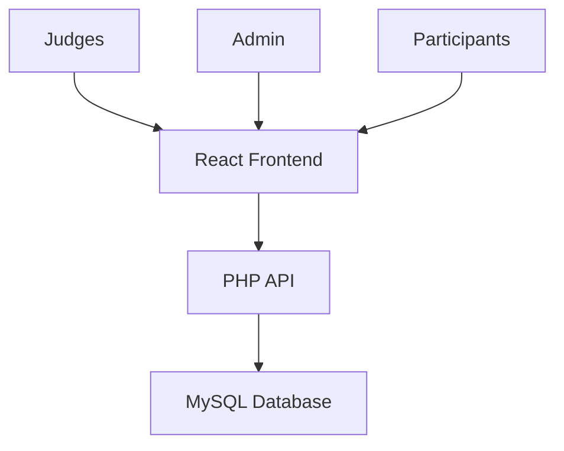
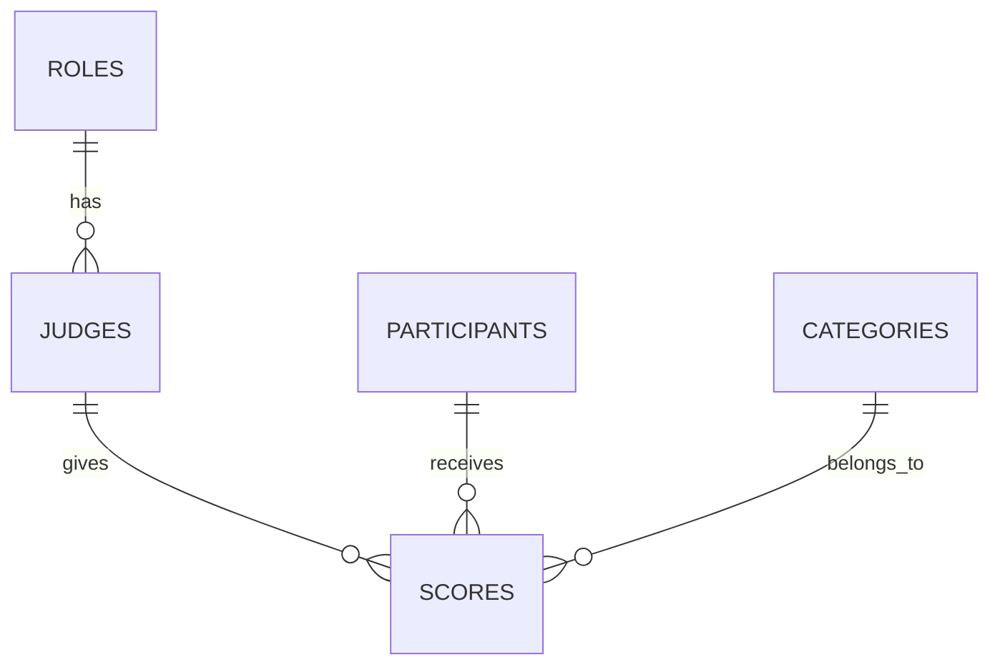

# Scoring System Web App

A simple, real-time web app for managing competition scores, built with a LAMP stack (Linux, Apache, MySQL/MariaDB, PHP) and a React frontend.

---

## 📝 Overview

This mockup app lets:

- **Judges** score participants.
- **Admins** manage judges and view data.
- **Participants** view the live scoreboard.

Uses a RESTful PHP API, MySQL database, and React frontend for a dynamic UI.

---

## 🏗 Architecture



---


## 🧩 Installation

```bash
# Clone repository
git clone [repo_url]

# Setup database
mysql -u [user] -p [database_name] < backend/database/database.sql

# Install PHP dependencies
cd backend
[composer_command_placeholder]

# Install React dependencies
cd frontend
npm install
```


## ⚙️ Prerequisites

- **LAMP Stack**: Linux, Apache, MySQL/MariaDB, PHP `[version placeholder]`
- **Node.js**: `[version placeholder]`
- **Composer**: Optional (not used in this mockup)

---

## 🛠️ Setup Instructions

### 1. Set Up Apache & MySQL

```bash
# Import the database
mysql -u [user] -p [database_name] < backend/database.sql
````

Edit `backend/api/config.php`:

```php
define('DB_HOST', '[host]');
define('DB_NAME', '[database_name]');
define('DB_USER', '[user]');
define('DB_PASS', '[password]');
```

---

### 2. Fix MySQL Access (If Needed)

```bash
sudo systemctl stop mariadb
sudo mysqld_safe --skip-grant-tables --skip-networking &
mysql -u root
```

Inside MySQL:

```sql
USE mysql;
ALTER USER 'root'@'localhost' IDENTIFIED WITH mysql_native_password BY '[new_password]';
FLUSH PRIVILEGES;
```

Then:

```bash
sudo killall mysqld
sudo systemctl start mariadb
mysql -u root -p
```

---

### 3. Configure Apache

```bash
# Place the backend folder in:
# /var/www/html/[app_name]/backend

sudo a2enmod rewrite
sudo systemctl restart apache2
```

Update `/etc/apache2/sites-available/000-default.conf`:

```apache
<Directory /var/www/html>
    AllowOverride All
</Directory>
```

Then:

```bash
sudo systemctl restart apache2
```

---

### 4. Set Up React Frontend

```bash
cd frontend
npm install
npm start
```

Runs on `[frontend_url]`, proxies API calls to `[backend_api_url]`.

---

### 5. Access the App

* **Scoreboard**: `[frontend_url]/`
* **Judge Portal**: `[frontend_url]/judge`
* **Admin Panel**: `[frontend_url]/admin`
* **Participant Panel**: `[frontend_url]/participant`

---

## 📁 Project Structure

```
scoringsystem/
├── frontend/
│   ├── public/
│   └── src/
│       ├── components/
│       │   ├── cards/
│       │   │   ├── StatCard.js
│       │   │   └── UserCard.js
│       │   ├── icons/
│       │   │   └── index.js
│       │   ├── layout/
│       │   │   ├── Header.js
│       │   │   ├── Sidebar.js
│       │   │   └── Footer.js
│       │   ├── AdminPanel.js
│       │   ├── ErrorBoundary.js
│       │   ├── JudgePortal.js
│       │   ├── Login.js
│       │   ├── Overview.js
│       │   ├── Participants.js
│       │   └── Scoreboard.js
│       ├── contexts/
│       │   └── AuthContext.js
│       ├── utils/
│       │   ├── avatarUtils.js
│       │   └── formatters.js
│       ├── App.js
│       └── index.js
├── backend/
│   ├── api/
│   │   ├── login.php
│   │   ├── get_stats.php
│   │   ├── get_participants.php
│   │   ├── submit_score.php
│   │   └── get_categories.php
│   ├── config/
│   │   ├── db_connect.php
│   │   └── config.php
│   ├── database/
│   │   ├── schema.sql
│   │   └── migrations/
│   ├── middleware/
│   │   └── auth.php
│   ├── helpers/
│   │   └── JWT.php
│   ├── tests/
│   │   └── api/
│   └── cache/
├── docs/
│   ├── api.md
│   └── setup.md
└── README.md
```

---

## 🧩 Database Schema

Tables include:

* `judges`: Judge info
* `participants`: Participant info
* `scores`: Points awarded
* `categories`: Score categories
* `roles`: User roles



---

## 🌐 API Endpoints

RESTful API served from `backend/api/`.

| Endpoint                    | Method | Auth     | Description                    |
| --------------------------- | ------ | -------- | ------------------------------ |
| `/api/login.php`            | POST   | None     | Log in a user                  |
| `/api/get_judges.php`       | GET    | None     | List all judges                |
| `/api/add_judge.php`        | POST   | Admin    | Add a new judge                |
| `/api/get_participants.php` | GET    | Optional | List all participants          |
| `/api/users.php`            | GET    | None     | Alias for listing participants |
| `/api/get_categories.php`   | GET    | None     | List all categories            |
| `/api/scores.php`           | GET    | None     | Get scoreboard                 |
| `/api/submit_score.php`     | POST   | Judge    | Submit a score                 |
| `/api/get_stats.php`        | GET    | None     | Get system stats               |

---

## 📡 API Details

### `/api/login.php`

```json
POST
{
  "email": "[string]",
  "password": "[string]"
}
```

---

### `/api/get_stats.php`

```http
GET
```

Response: `[judge/participant stats]`

---

### `/api/get_participants.php`

```http
GET
```

Response: `[array of { id, name }]`

---

### `/api/submit_score.php`

```json
POST
{
  "judge_id": [integer],
  "participant_id": [integer],
  "points": [1-100],
  "category_id": [integer]
}
```

---

### `/api/get_categories.php`

```http
GET
```

Response: `[array of { id, name }]`

---

## 👥 User Roles

* **Admin**: Manage judges, view stats
* **Judge**: Submit scores
* **Participants**: View the scoreboard

---

## 💡 Design Choices

* **LAMP Stack**: Proven for backend use
* **React Frontend**: Dynamic UI, \[HTTP client placeholder]
* **Database**: Normalized, prevents duplicate scores
* **API**: RESTful, secure via prepared statements
* **Scoreboard**: Refreshes every `[interval placeholder]`
* **Security**: No auth in mockup. Use `[auth method placeholder]` in production

---

## 📌 Assumptions

* `/users.php` = participants
* Participants preloaded in DB
* Local setup
* API at `[backend_api_url]`

---

## 🧪 Testing

**Backend Tests:**

```bash
cd backend
[test_command_placeholder]
```

**Frontend Tests:**

```bash
cd frontend
npm test
```

---

## 🚀 Future Improvements

* Add `[auth method placeholder]`
* Form validation
* Responsive design with `[CSS framework placeholder]`
* Admin UI to manage participants
* Real-time scoreboard using `[real-time tech placeholder]`
* Add logging via `[logging tool placeholder]`

---

## 🌍 Deployment

1. Deploy PHP backend to `[server placeholder]`
2. Build React app:

```bash
cd frontend
npm run build
```

3. Serve via `[server/CDN placeholder]`
4. Update CORS in `backend/api/config.php`

> ⚠️ Note: No public link for local setup

---
