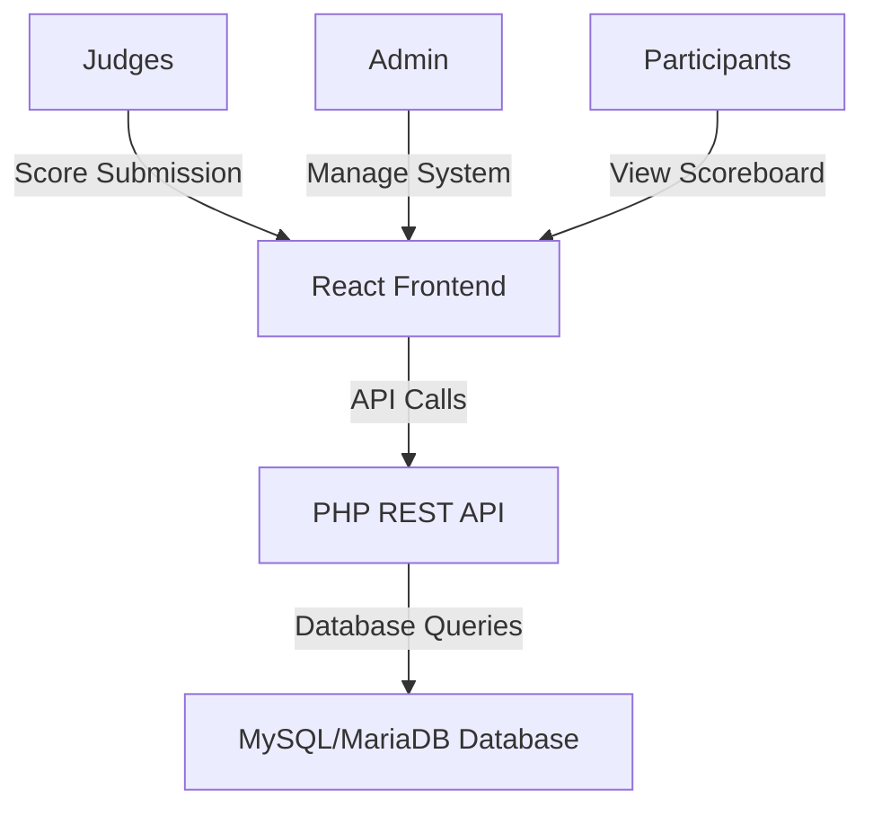
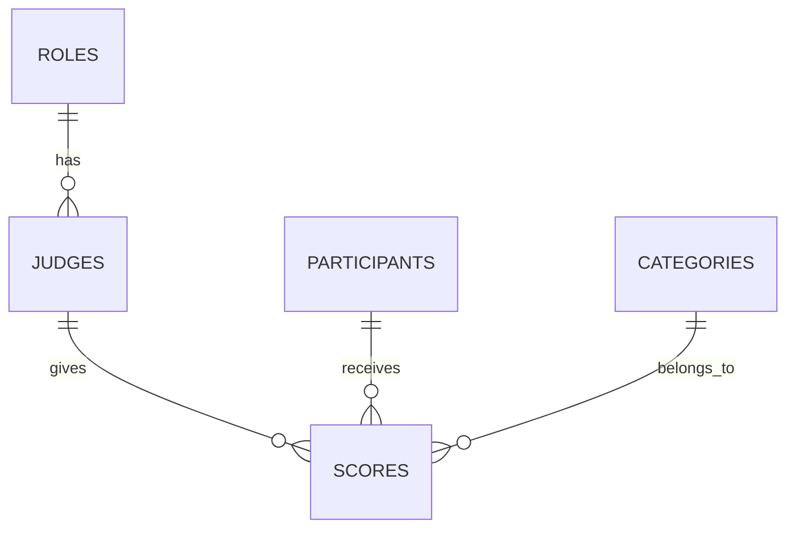

# 🎯 Scoring System Web App

A sleek, real-time web application for managing competition scores, built with a **LAMP stack** (Linux, Apache, MySQL/MariaDB, PHP) and a **React frontend**. Ideal for competitions, tournaments, or events requiring live score tracking.

## Live Website
The application is deployed and accessible at:
[Scoring_System_Live](https://white-meadow-0c5eba71e.6.azurestaticapps.net)


## Key Features
- Public scoreboard with live updates
- Judge authentication and scoring interface
- Sorting by average score or total points
- Participant management
- Database-driven with Azure MySQL backend

## Technology Stack
- **Frontend**: React, Tailwind CSS
- **Backend**: PHP
- **Database**: Azure MySQL
- **Hosting**: Azure Static Web Apps (frontend), Azure App Service (backend)
- **CI/CD**: GitHub integration


## 📝 Overview

This app enables:

* **Judges** to submit scores for participants.
* **Admins** to manage judges and view system analytics.
* **Participants** to monitor a live scoreboard.

Built with a **RESTful PHP API**, a **MySQL/MariaDB database**, and a **React frontend** for a dynamic, user-friendly interface.

---

## 🏗️ Architecture



---

## 🧩 Installation

### 🔄 Clone the Repository

```bash
git clone https://github.com/Dennis-DW/-Scoring-System-Web-App.git
```

### 🛢️ Set Up the Database

```bash
mysql -u [user] -p [database_name] < backend/sql/database.sql
```

### ⚙️ Install Backend Dependencies

```bash
cd backend
composer install  # If Composer is used
```

### ⚛️ Install Frontend Dependencies

```bash
cd frontend
npm install
```

---

## ⚙️ Prerequisites

* **LAMP Stack**:

  * Linux OS
  * Apache Web Server
  * MySQL/MariaDB
  * PHP 
* **Node.js**: 
* **Composer** *(optional, for PHP dependency management)*

---

## 🛠️ Setup Instructions

### 1. ⚙️ Configure Apache & MySQL

#### Import the Database

```bash
mysql -u [user] -p [database_name] < backend/database.sql
```

#### Configure Database Connection

Edit `backend/api/config/db_config`:

```
<?php
return [
    'host' => 'localhost',
    'dbname' => 'database_name',
    'username' => 'user',
    'password' => 'password'
];
```

---

### 2. 🔐 Fix MySQL Access (If Needed)

```bash
sudo systemctl stop mariadb
sudo mysqld_safe --skip-grant-tables --skip-networking &
mysql -u root
```

Inside MySQL shell:

```sql
USE mysql;
ALTER USER 'root'@'localhost' IDENTIFIED WITH mysql_native_password BY '[new_password]';
FLUSH PRIVILEGES;
```

Restart:

```bash
sudo killall mysqld
sudo systemctl start mariadb
mysql -u root -p
```

---

### 3. 🧭 Configure Apache

Place the backend folder in:

```
/var/www/html/[app_name]/backend
```

Enable URL rewriting:

```bash
sudo a2enmod rewrite
sudo systemctl restart apache2
```

Edit `/etc/apache2/sites-available/000-default.conf`:

```apache
<Directory /var/www/html>
    AllowOverride All
</Directory>
```

Restart Apache:

```bash
sudo systemctl restart apache2
```

---

### 4. ⚛️ Set Up the React Frontend

```bash
cd frontend
npm install
npm start
```

* Frontend runs on **\[http://localhost:3000]**
* Proxies API requests to **\[http://localhost/scoringsystem/backend/api]**

---

### 5. 🚪 Access the Application

* **Live Scoreboard**: \[frontend\_url]/
* **Judge Portal**: \[frontend\_url]/judge
* **Admin Panel**: \[frontend\_url]/admin
* **Participant Panel**: \[frontend\_url]/participant

---


## 🧩 Database Schema

The database includes the following tables:

* `judges`: Stores judge information
* `participants`: Stores participant details
* `scores`: Tracks points awarded
* `categories`: Defines scoring categories
* `roles`: Manages user roles



---

## 🌐 API Endpoints

Base path: `backend/api/`

| Endpoint                    | Method | Auth     | Description                |
| --------------------------- | ------ | -------- | -------------------------- |
| `/api/login.php`            | POST   | None     | Authenticate a user        |
| `/api/get_judges.php`       | GET    | None     | List all judges            |
| `/api/add_judge.php`        | POST   | Admin    | Add a new judge            |
| `/api/get_participants.php` | GET    | Optional | List participants          |
| `/api/users.php`            | GET    | None     | Alias for participants     |
| `/api/get_categories.php`   | GET    | None     | List score categories      |
| `/api/scores.php`           | GET    | None     | Retrieve scoreboard data   |
| `/api/submit_score.php`     | POST   | Judge    | Submit a score             |
| `/api/get_stats.php`        | GET    | None     | Retrieve system statistics |

---

## 📡 API Details

### `/api/login.php`

**POST JSON:**

```json
{
  "email": "[string]",
  "password": "[string]"
}
```

**Sample Credentials**:

* Admin: `admin@example.com / admin123`
* Judge: `dennis@example.com / password123`

---

### `/api/get_stats.php`

**GET** – Returns judge and participant statistics

### `/api/get_participants.php`

**GET** – Returns:

```json
[
  { "id": 1, "name": "Participant A" },
  ...
]
```

---

### `/api/submit_score.php`

**POST JSON:**

```json
{
  "judge_id": [integer],
  "participant_id": [integer],
  "points": [1-100],
  "category_id": [integer]
}
```

---

### `/api/get_categories.php`

**GET** – Returns:

```json
[
  { "id": 1, "name": "Creativity" },
  ...
]
```

---

## 👥 User Roles

* **Admin**: Manage judges, view stats
* **Judge**: Submit scores
* **Participant**: View scoreboard

---

## 💡 Design Choices

* **LAMP Stack**: Robust and widely supported
* **React Frontend**: Dynamic UI using \[HTTP client placeholder]
* **Database**: Normalized schema to prevent duplication
* **API**: RESTful, secure with prepared statements
* **Scoreboard**: Auto-refreshes every \[interval placeholder]
* **Security**: Placeholder setup; recommend \[auth method placeholder] in production

---

## 📌 Assumptions

* `/users.php` = Participants
* Participants are preloaded in DB
* App runs locally
* API available at **\[backend\_api\_url]**

---

## 🧪 Testing

### Backend

```bash
cd backend
[test_command_placeholder]
```

### Frontend

```bash
cd frontend
npm test
```

---

## 🌍 Deployment

The system uses Azure's cloud infrastructure for reliable hosting and database services.
---
---
--

